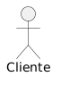
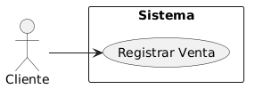
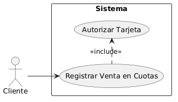
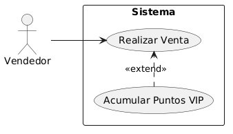
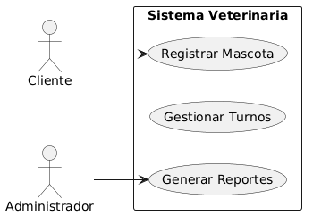

# Módulo 2: Casos de Uso

---

## 2.1 ¿Qué es el Comportamiento del Sistema?

El **comportamiento del sistema** es como el sistema actúa y reacciona a estímulos externos.

- Es la **actividad visible** exteriormente y a la que se le pueden hacer pruebas.
- Define los **requerimientos funcionales** del sistema.
- Se captura en los **Casos de Uso**.
- Los casos de uso describen al sistema, su ambiente y las relaciones entre el sistema y su ambiente.

---

## 2.2 El Modelo de Casos de Uso

> *"El modelo de CU sirve como un acuerdo entre clientes y desarrolladores, y proporciona la entrada fundamental para el análisis, diseño, y las pruebas."*

Un **Modelo de Casos de Uso** es un modelo del sistema que contiene **actores, casos de uso y sus relaciones**.

### Propósito principal:
Comunicar la **funcionalidad y comportamiento** del sistema al cliente y/o usuario final para que lo valide.

### ¿Para qué se usa?

**Para identificar:**
- Los flujos funcionales que deben realizarse con el sistema.
- Los roles de usuarios que deben interactuar con el sistema.
- Las interfaces que debe tener el sistema hacia sistemas externos.

**Para verificar:**
- Que todos los requerimientos funcionales se han capturado.
- Que todos los desarrolladores han entendido esos requerimientos.

**Además:**
- Facilita la **comunicación con los usuarios finales y expertos del dominio**.
- Proporciona aceptación desde las primeras etapas de desarrollo.

---

## 2.3 Actores

> *"Los actores representan terceros fuera del sistema que colaboran con el sistema."*

### Características:
- Si hemos identificado todos los actores, tenemos identificado el **entorno externo del sistema**.
- Cada vez que un usuario concreto (humano u otro sistema) interactúa con el sistema, la instancia correspondiente del actor está desarrollando ese papel.
- **Una instancia de un actor es por tanto un usuario concreto que interactúa con el sistema.**

### Propiedades de los actores:
- Los actores **no son parte del sistema**, ellos representan roles que pueden jugar usuarios del sistema.
- Un actor puede **intercambiar información activamente** con el sistema.
- Un actor puede ser un **receptor pasivo** de información.
- Un actor puede representar a un **ser humano, una máquina o a otro sistema**.

### Un usuario puede actuar como diferentes actores:
Por ejemplo, Carlos puede interactuar con el sistema como "Cliente" o como "Técnico de Mantenimiento" según el rol que esté ejerciendo.

### Preguntas útiles para identificar actores:
- ¿Quién está interesado en cierto requerimiento?
- ¿Dónde se usa el sistema en la organización?
- ¿Quién suplirá al sistema de información, quién usa y elimina esta información?
- ¿Quién usará esta función?
- ¿Quién dará soporte y mantenimiento al sistema?
- ¿El sistema usa un recurso externo?
- ¿Qué actores necesitan los casos de uso?
- ¿Algún actor interpreta varios roles diferentes?
- ¿Existen varios actores con el mismo rol?

---

## 2.4 Caso de Uso

Cada forma en que los actores usan el sistema se representa con un **Caso de Uso (CU)**.

### Definición:
Un CU es algo de funcionalidad ejecutada por el sistema en respuesta a un estímulo de un actor externo.

- Los casos de uso son **"fragmentos de funcionalidad que el sistema ofrece para aportar un resultado de valor para sus actores"**.
- Especifica una secuencia de acciones que el sistema puede llevar a cabo interactuando con sus actores (incluyendo alternativas dentro de la secuencia).
- Un CU **entrega un resultado observable** que añade valor a un actor en concreto.

> *Cada ejecución satisfactoria de un CU debe proporcionar algún valor al actor para alcanzar su objetivo. Esto se debe aplicar al actor iniciador.*

### Instancia de Caso de Uso:
- Una **instancia de CU** es la realización o ejecución de un CU.
- Esta interactúa con instancias de actores y ejecuta una secuencia específica de acciones principales.
- Puede haber **alternativas** en la secuencia de acciones (otros caminos).
- Consideramos **atómicas** las instancias de CU: cada una se ejecuta por completo o no se ejecuta nada.

### Preguntas útiles para identificar Casos de Uso:
- ¿Cuáles son las tareas de este actor?
- ¿El actor creará, guardará, cambiará, eliminará o leerá información del sistema?
- ¿El actor necesitará informar al sistema acerca de cambios externos repentinos?
- ¿Necesita el actor ser informado acerca de ciertas ocurrencias en el sistema?
- ¿Le proporciona el sistema al negocio el comportamiento correcto?
- ¿Qué casos de uso darán soporte y mantenimiento al sistema?
- ¿Pueden los casos de uso ejecutar todos los requerimientos funcionales?

---

## 2.5 Representación en UML

### El Actor:



### El Caso de Uso:



### La Asociación (comunicación entre Actor y CU):
- Se representa con una **línea con punta de flecha**.
- La dirección de la flecha indica quién envió el primer mensaje.
- Para cada mensaje enviado se asume una respuesta.

### Ejemplo — Sistema de Control de Cajeros:
```
[Cajero de Ventanilla] ──→ (Hacer Transacción Para Cliente)
[Cajero de Ventanilla] ──→ (Hacer Cierre de Caja)
```

---

## 2.6 Asociación o Inclusión (¿CU completo o incluido?)

Una secuencia de acciones usuario-sistema se puede especificar en **un CU o varios**, los cuales el actor invoca uno tras otro.

Hay que considerar si un CU es **completo por sí mismo** (*asociación*) o si **siempre se ejecuta a continuación de otro** CU (*inclusión*).

---

## 2.7 Escenarios

### ¿Qué son escenarios?
> Un **escenario** es una **instancia de un caso de uso**: un flujo a través de un caso de uso.

### Tipos de escenarios:
Cada caso de uso tendrá una red de escenarios:

- **Escenarios exitosos** ("happy day scenarios"): flujo básico — la forma en la que el sistema debe funcionar idealmente o la mayoría de las veces.
- **Escenarios alternativos**:
  - Flujos alternos
  - Flujos de excepción


## 2.8 Pasos para construir el Modelo de Casos de Uso

Es preciso seguir estos pasos en orden:

1. **Encontrar los actores**
2. **Encontrar los casos de uso**
3. **Describir brevemente** cada caso de uso
4. **Describir los caminos básicos** de todos los casos de uso
5. **Reestructurar el modelo** al:
   - Factorizar comportamientos comunes y compartidos *(casos incluidos)*
   - Agregar comportamientos adicionales u opciones *(extensiones a un CU)*

---

## 2.9 Paso 2: Encontrar Casos de Uso

- Para encontrar los CU, se propone por cada actor encontrado **una función del sistema**.
- Se elige un **nombre** para cada CU que nos haga pensar en la secuencia de acciones concreta que añade valor a un actor.
- El nombre de un CU a menudo **comienza con un verbo** y debe reflejar cuál es el objetivo de la interacción entre el actor y el sistema.

---

## 2.10 Paso 3: Descripción Breve

La **Descripción Breve** consiste en explicar cada CU en unas pocas palabras o frases que **resumen** las acciones que se realizan.

En el **Camino Básico** se coloca una detallada descripción paso a paso de lo que el sistema necesita hacer en la interacción con el actor.

---

## 2.11 Paso 4: Pre-Post-Condición y Camino Exitoso

### Pre-condición:
Se debe definir el estado inicial como **precondición** (el estado en que debe estar el sistema para que pueda iniciarse el CU).

### Camino Exitoso:
El **camino exitoso** de cada CU es una descripción textual de la secuencia de acciones del CU. Especifica lo que el sistema hace y cómo interactúa con los actores cuando se lleva a cabo ese CU.

> *El camino exitoso debe ser el más normal, que se percibe habitualmente, aquel que proporciona el valor más obvio.*

En el camino exitoso debe asegurarse que vaya:
- Cómo y cuándo comienza el CU (la primera acción)
- El orden en que las acciones se deben ejecutar (numeración)
- La interacción de los actores con el sistema
- Lo que explícitamente hace el sistema (las acciones que ejecuta)
- Los cambios que se producen en el sistema
- La utilización de objetos, valores de atributos y recursos del sistema
- Cómo y cuándo termina el CU

### Caminos Alternativos:
Se describen en secciones separadas, como las desviaciones del camino exitoso (flujos alternos, excepciones, errores, etc.).

### Post-condición:
Se definen los posibles estados finales como **postcondiciones**.

---

## 2.12 Paso 5: Reestructurar el Modelo

### Relaciones entre Casos de Uso

Una vez armado el modelo, se reestructura para:

### Include (Inclusión):
Sirve para **reducir la redundancia**: un código puede extraerse y describirse en un CU separado que puede ser reutilizado por el caso de uso original.

- Si un CU A incluye a un CU B, indica que **una instancia del caso A incluirá también el comportamiento especificado en B**.
- En el *include* es **necesario** que ocurra el caso incluido, tan sólo para satisfacer el objetivo del caso de uso base.

**Ejemplo:**



Cada vez que se registra una venta en cuotas, *siempre* se autoriza la tarjeta.

### Extend (Extensión):
Modela la **adición** de una secuencia de acciones a un CU. La extensión se comporta como si fuera algo que se añade a la descripción, en ciertos casos particulares del caso de uso.

- En el *extend*, el caso de uso de extensión **no es indispensable** que ocurra; cuando lo hace ofrece un valor extra (extiende) al objetivo original del caso de uso base.

**Ejemplo:**



Puedes realizar una venta sin acumular puntos VIP, pero si eres cliente VIP sí acumularás puntos.

---

## 2.13 Include vs. Extend: Diferencias Clave

| Característica | Include | Extend |
|----------------|---------|--------|
| ¿Es obligatorio? | **Sí**, siempre ocurre | **No**, solo en ciertos casos |
| Propósito | Reutilizar comportamiento común | Agregar comportamiento opcional |
| Sin el CU relacionado... | El CU base **no puede funcionar** | El CU base **funciona igual** |
| Dirección de dependencia | El base depende del incluido | El extendido depende del base |

---

## 2.14 ❌ Error Común: Inclusiones de Inclusiones

> **El objetivo de include y extend NO consiste en motivar la división de los casos de uso en la mayor cantidad de pedazos.**

- Debe existir una **razón importante** para decidir dividir un CU en dos que serán unidos por estas relaciones.
- Al modelar el diagrama de casos de uso **no buscamos analizar el detalle**, y mucho menos los flujos.
- Todo ese detalle se plasma en otros tipos de diagramas: de interacción, de actividad, de estados, o en la especificación textual.

**¿Por qué la gente comete este error?**
Porque quieren conocer, entender y comunicar el máximo detalle de los CU en el diagrama. Llegan a utilizar, erróneamente, estas relaciones para mostrar el orden en que se ejecutan los casos de uso.

---

## 2.15 Reuso: Evitando el Retrabajo

Una de las razones para usar include/extend es porque identificas que hay **pasos que son iguales en dos o más casos de uso**. Así, no hay que escribir y mantener a cada uno de las copias.

Además, ofrecen un **único punto de código a corregir o cambiar**, evitando riesgos de modificar en una copia y no en los demás.

### Mejor mantener el modelo simple:
- Son relaciones usadas para unir 2 CU cuyos flujos de eventos ocurren normalmente en una sola sesión del usuario.
- Podríamos colocarlos como un sólo CU en lugar de dos, ya que ocurren juntos.
- Hay una razón por la cual decidimos separarlos en dos: **REUTILIZACIÓN DE CÓDIGO**.

---

## 2.16 Frontera del Sistema

La **frontera del sistema** delimita qué está dentro y qué está fuera del sistema a desarrollar.

- Los actores están **fuera** de la frontera.
- Los casos de uso están **dentro** de la frontera.
- Identificar todos los actores equivale a identificar el **entorno externo** del sistema.



---

*← [Volver al índice](./README.md)*
