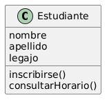

# Módulo 3: Clases en el Modelado de Software

---

## 3.1 ¿Qué son las Clases?

Cuando se han identificado muchos objetos en un dominio, decimos que una **clase** es una abstracción que describe un grupo de objetos que tienen:

- **Propiedades en común** (atributos)
- **Comportamiento en común** (operaciones)
- **Relaciones comunes** con otros objetos (asociaciones)
- **Semántica en común** (descripción breve)

### Una clase es una abstracción porque:
- **Enfatiza** características relevantes al sistema.
- **Suprime** otras características no relevantes.

> Así como la abstracción general minimiza la complejidad, las clases permiten manejar grupos de objetos con un solo concepto.

---

## 3.2 Guía para Encontrar Clases

> **Una clase debe capturar una y solo una abstracción principal.**

### Ejemplo:
- ❌ **Mala abstracción**: clase `Estudiante` que incluye el horario del estudiante para el semestre → mezcla dos abstracciones.
- ✅ **Buenas abstracciones**: clases separadas para `Estudiante` y `Horario`.

```
Estudiante                  :Horario
──────────                  ─────────────────────
(atributos                  • Inglés 101 (66574)
 del estudiante)            • Geología 110 (55342)
                            • Historia Mundial 200 (85463)
                            • Álgebra 110 (76453)
```

---

## 3.3 Nombrando las Clases

### Regla principal:
El nombre de una clase debe ser el **sustantivo singular** que mejor caracteriza la abstracción que se quiere representar.

### Señales de alerta:
- El que haya dificultad para nombrar una clase **puede ser indicio de que la abstracción no se entiende bien o no está bien definida**.

### Fuente de los nombres:
Los nombres de las clases deben tomarse **directamente del vocabulario del dominio**:
- Evitar dar nombres "más representativos" a las clases que modelan cosas que ya tienen un nombre difundido en el dominio (ej: usar `OrdenDeTrabajo` en vez de `Ticket`).
- Las mejores fuentes son: entrevistas con expertos del dominio y la documentación propia del dominio (guías de operación, manuales de procedimientos, etc.).
- Los principales términos, siglas, apodos, etc. del vocabulario del dominio, deben definirse e incluirse en la documentación del proyecto (en el RUP se llama a esto el **Documento de Glosario**).

---

## 3.4 Guía de Estilo para Nombrar Clases

El proyecto debe contar con una guía de estilo que dicte convenciones para presentar los nombres de las clases.

### Muestra de una Guía de Estilo:
- Las clases se nombran con **sustantivos en singular**.
- Los nombres de clases **comienzan con mayúscula**.
- El carácter de subrayado **no se usa** para unir palabras.
- Los nombres compuestos de varias palabras se unen y **la inicial de cada palabra se pone en mayúscula** (PascalCase).

### Ejemplos correctos:
```
Estudiante    Profesor    PlanDeEstudios 
```

---

## 3.5 Definir la Semántica de la Clase

Luego de nombrar la clase, debe hacerse una **descripción breve y concisa** (Definición de Trabajo o *Working Definition*).

### Reglas para la semántica:
- Enfóquese en el **propósito** de la clase, no en la implementación.
- El nombre de la clase y la descripción forman la base de un **Diccionario del Modelo**.

> **Busque los "QUÉS" e ignore los "CÓMOS"**

---

## 3.6 Representando Clases con UML

Las clases se representan en **Diagramas de Clases**: diagramas que en un mismo plano muestran uno o más iconos, donde cada icono representa una clase específica.

### El ícono de una clase en UML:
Un **rectángulo** que contiene el nombre de la clase y opcionalmente 3 compartimientos:



---

## 3.7 Perspectivas en los Diagramas de Clases

Los diagramas de clases pueden ser desde muy abstractos hasta muy concretos, dependiendo de lo que algunos autores llaman la **"perspectiva"** que se haya tomado al crearlos.

| Perspectiva | Uso | Características |
|-------------|-----|-----------------|
| **Conceptual** | Modelo Conceptual | Modela conceptos puros o abstracciones. Diagramas muy sencillos; solo nombrar las clases. |
| **Especificación** | Modelo de Análisis | Las clases están en el punto medio de ser abstractas y concretas; define qué deben hacer, pero no cómo. Tienen algún grado de complejidad y detalle. |
| **Implementación** | Modelo de Diseño | Las clases son muy concretas; incluyen toda la información de cómo construirlas. Los diagramas son muy detallados y complejos. |

---

## 3.8 Estereotipos (Stereotypes)

Un **estereotipo** es un nuevo tipo de elemento de modelación que extiende la semántica del metamodelo.

- Deben estar basados en tipos existentes o clases del metamodelo.
- Es el **mecanismo que UML provee para extender la notación**.
- **Cada clase de análisis debe tener un estereotipo**.

### Estereotipos comunes:
- Clase de límite (`<<boundary>>`)
- Clase de entidad (`<<entity>>`)
- Clase de control (`<<control>>`)
- Clase de excepción
- Clase de Utilería
- Meta clase

----

## 3.9 Clases de Análisis: Los Tres Estereotipos Principales

Las clases de análisis se clasifican según la metodología **OOSE de Ivar Jacobson** para crear modelos ideales de objetos.

Esta metodología se basa en el patrón de análisis **MVC (Model-View-Controller)**, que define clases enfocadas en la separación de responsabilidades para conseguir componentes extensibles y reutilizables.

```
          Vista (<<boundary>>)
              │
              ▼
         Control (<<control>>)
              │
              ▼
          Modelo (<<entity>>)
```

---

## 3.10 Diagramas de Clases en el Modelo de Análisis

Un **diagrama de clases** muestra una o más clases en un mismo plano, usando la nomenclatura que se ha presentado antes.


---

## 3.11 Filtrando Sustantivos (Técnica de Identificación)

Una técnica para encontrar clases es identificar **sustantivos** en la descripción del problema.

### Consideraciones importantes:
- Varios términos pueden referirse al mismo objeto.
- Un término puede referirse a más de un objeto.
- El lenguaje natural es muy ambiguo.

Esto puede llevar a identificar muchos objetos sin importancia, por lo que la **lista de sustantivos debe filtrarse**.

### Advertencia:
- Cualquier sustantivo puede ser convertido en verbo; cualquier verbo puede ser convertido en sustantivo.
- Los resultados dependen en gran parte de la capacidad de redacción de el o los autores.

---

*← [Volver al índice](./README.md)*
