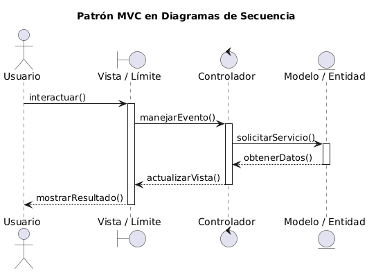
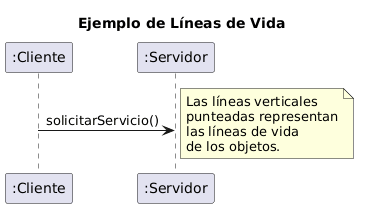
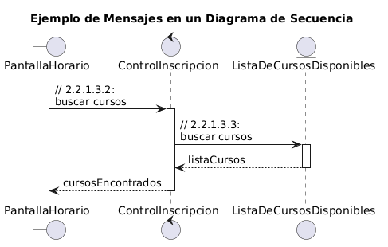
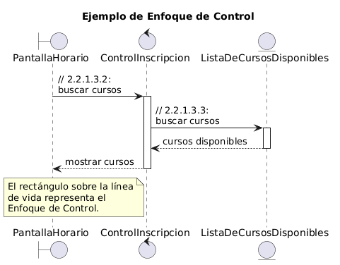
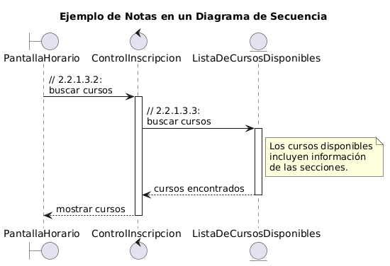
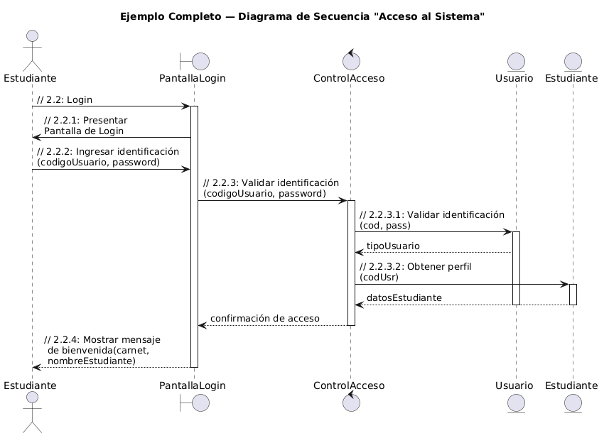

# Módulo 4: Diagramas de Interacción y Secuencia

---

## 4.1 ¿Qué son los Diagramas de Interacción?

Un **diagrama de interacción** es una representación gráfica de las interacciones o intercambios de mensajes que deben darse entre objetos participantes para completar un Caso de Uso (CU).

### Tipos de diagramas de interacción:

| Tipo | Enfoque |
|------|---------|
| **Diagrama de Secuencia** | Ordenado en el **tiempo** |
| **Diagrama de Colaboración** | Muestra el **flujo de datos** |

Cada uno provee una **vista diferente de las mismas interacciones**. Son complementarios: ambos representan el mismo comportamiento desde ángulos distintos.

---

## 4.2 ¿Qué es un Diagrama de Secuencia?

Un **diagrama de secuencia** sirve para modelar las interacciones entre objetos **ordenadas en una secuencia en el tiempo**.

### Incluye:
- Los **objetos** que participan en el escenario con sus **"líneas de vida"**.
- Los **mensajes** intercambiados en una secuencia en el tiempo que representa el flujo de eventos del escenario.
- El **enfoque del control** sobre los objetos (opcional).

---

## 4.3 Modelo-Vista-Controlador en los Diagramas de Secuencia

Los diagramas de secuencia se alinean naturalmente con el patrón **MVC**:

Esto refleja el flujo típico de un escenario:
1. El usuario interactúa con la **Vista** (clase boundary).
2. La Vista dispara eventos al **Controlador** (clase control).
3. El Controlador consulta o modifica el **Modelo** (clase entity).
4. La respuesta retorna al usuario a través de la Vista.

---

## 4.4 Representando Objetos en Diagramas de Secuencia

Los objetos se dibujan como **rectángulos con nombres subrayados** (igual que en otros diagramas UML), en tres formatos posibles:

| Formato | Ejemplo | Descripción |
|---------|---------|-------------|
| Objeto específico | `Ingles 101` | Solo nombre del objeto |
| Objeto específico con clase | `Ingles 101:Curso` | Nombre y clase |
| Objeto genérico | `:Curso` | Solo nombre de la clase |
| Estereotipo (ícono) | (círculo/rectángulo según tipo) | Representación visual del estereotipo |

### Las Líneas de Vida:
Las **"líneas de vida"** de los objetos se muestran como **líneas descendentes intermitentes** y representan el tiempo en que los objetos están instanciados.

## 4.5 Mostrando la Interacción entre Objetos

### Mensajes:
- La interacción se indica con **flechas horizontales** que van de la línea de vida del objeto cliente (que inicia) a la del objeto suplidor (que recibe y responde).
- Las flechas horizontales se etiquetan con la frase que mejor represente el mensaje intercambiado.
- A la etiqueta se le antepone `//` para indicar que se trata de un mensaje en análisis (todavía se está haciendo Análisis).

### Orden temporal:
- El orden de los mensajes en el tiempo se indica por su **posición vertical**: el primer mensaje es el que aparece más arriba.

### Numeración:
La numeración es opcional, pero puede utilizarse para hacer referencia a la numeración jerárquica de los eventos tal como se describen en el Flujo Detallado del CU.

**Ejemplo:**

## 4.6 ¿Qué es el Enfoque de Control (Focus Control)?

El **Enfoque de Control** representa el tiempo relativo durante el cual el flujo del control se enfoca en un objeto.

- Representa el tiempo en que un objeto está **enviando mensajes y esperando recibir respuestas**.
- Se indica en un diagrama de secuencia dibujando un **rectángulo** sobre la línea de vida del objeto en que está enfocado el control.

## 4.7 Notas en los Diagramas de Secuencia

Se pueden usar **notas** para añadirle más información al diagrama cuando se quiere:
- Asegurar que se está comunicando un detalle específico.
- Hacer una aclaración.

Las notas se escriben en **texto libre** y se conectan con línea punteada al elemento al que refieren.

## 4.9 Ejemplo Completo: Diagrama de Secuencia para Login

Este ejemplo muestra el CU "Acceso al Sistema":

*← [Volver al índice](./README.md)*

---

> **Recursos adicionales sugeridos:**
> - Larman, C. (2003). *UML y Patrones*. Prentice Hall.
> - Booch, G., Rumbaugh, J., & Jacobson, I. (1999). *El Lenguaje Unificado de Modelado*. Addison-Wesley.
> - Jacobson, I. (1992). *Object-Oriented Software Engineering: A Use Case Driven Approach*.
