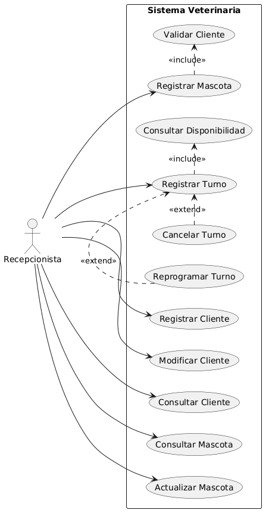
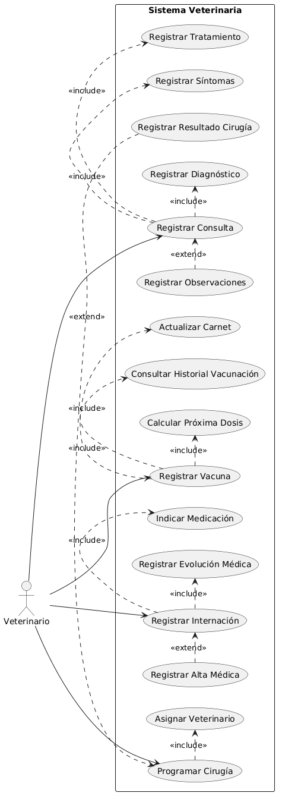
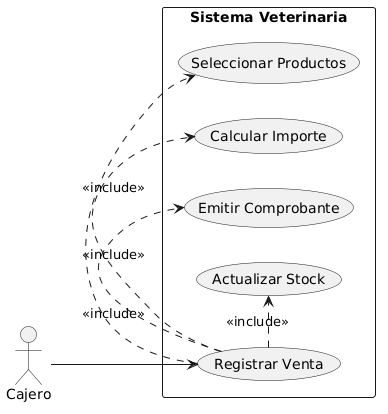
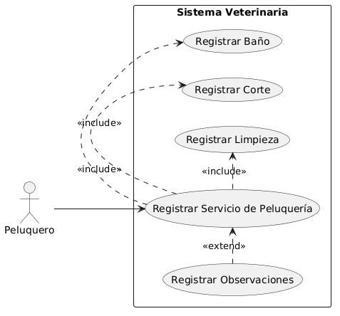
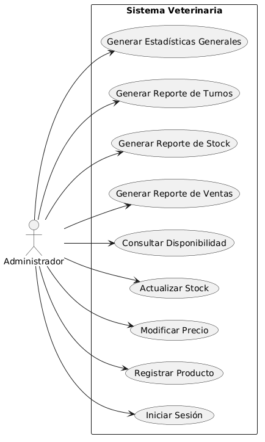

## 👥 Actores del Sistema

El diagrama de casos de uso representa las principales funcionalidades que el sistema veterinario ofrece a los distintos actores que interactúan con él.

Su objetivo principal es mostrar:
- qué servicios brinda el sistema,
- quiénes los utilizan,
- y cómo se relacionan funcionalmente los distintos casos de uso.

El diagrama permite obtener una visión global del sistema antes de avanzar hacia modelos más detallados como:
- diagramas de clases,
- secuencia,
- o estados.

---

| Actor | Descripción |
|---|---|
| Recepcionista | Gestiona clientes, mascotas y turnos |
| Veterinario | Registra consultas, vacunas, internaciones y cirugías |
| Peluquero | Registra servicios de peluquería |
| Cajero | Gestiona ventas y cobros |
| Administrador | Gestiona productos y reportes |

Cada actor interactúa únicamente con las funcionalidades relacionadas a sus responsabilidades dentro de la veterinaria.

---

## 🎯 Casos de Uso Principales

| Código | Caso de Uso |
|---|---|
| CU01 | Registrar Cliente |
| CU02 | Registrar Mascota |
| CU03 | Gestionar Turnos |
| CU04 | Registrar Consulta |
| CU05 | Registrar Vacuna |
| CU06 | Registrar Internación |
| CU07 | Registrar Cirugía |
| CU08 | Registrar Servicio Peluquería |
| CU09 | Registrar Venta |
| CU10 | Gestionar Productos |
| CU11 | Generar Reportes |

---

# 👩‍💼 Actor:  Recepcionista

# 📖 Explicación — Casos de Uso Recepcionista

La recepcionista interactúa con las funcionalidades administrativas relacionadas con clientes, mascotas y turnos.

Puede:
- registrar clientes,
- modificar información,
- consultar clientes,
- registrar mascotas,
- actualizar información de mascotas,
- y gestionar turnos veterinarios.

---

# 📌 Relación <<include>>

La relación `<<include>>` representa funcionalidades obligatorias reutilizables.

Por ejemplo:
- para registrar una mascota, el sistema debe validar previamente la existencia del cliente,
- y para registrar un turno, el sistema debe consultar la disponibilidad de horarios.

Estas acciones siempre se ejecutan como parte del flujo principal.

---

# 📌 Relación <<extend>>

La relación `<<extend>>` representa escenarios alternativos u opcionales.

En este caso:
- cancelar turno,
- y reprogramar turno,

extienden el comportamiento base de registrar turno, ya que representan variantes de gestión sobre turnos previamente existentes.

---

# 📌 Objetivo del modelo

El diagrama permite representar las responsabilidades de la recepcionista dentro del sistema y las relaciones existentes entre funcionalidades administrativas vinculadas con la atención veterinaria.

---

 #  👨‍⚕️ Actor: Veterinario

 

 # 📖 Explicación  — Casos de Uso Veterinario

El veterinario interactúa con las funcionalidades clínicas del sistema veterinario.

Sus responsabilidades incluyen:
- registrar consultas,
- vacunas,
- internaciones,
- y cirugías.

---

# 📌 Relación <<include>>

Las relaciones `<<include>>` representan funcionalidades obligatorias reutilizadas dentro del flujo principal.

Por ejemplo:
- una consulta médica requiere registrar síntomas, diagnóstico y tratamiento,
- mientras que una vacunación requiere consultar historial, calcular la próxima dosis y actualizar el carnet sanitario.

Estas funcionalidades siempre forman parte del caso principal.

---

# 📌 Relación <<extend>>

Las relaciones `<<extend>>` representan comportamientos opcionales o condicionales.

Por ejemplo:
- registrar observaciones puede realizarse de manera opcional durante una consulta,
- registrar alta médica solo ocurre al finalizar una internación,
- y registrar resultados ocurre posteriormente a una cirugía programada.

---

# 📌 Objetivo del modelo

El diagrama representa las principales responsabilidades clínicas del veterinario dentro del sistema, permitiendo modelar procesos médicos y relaciones entre funcionalidades reutilizables y escenarios alternativos.

#  💰 Actor: Cajero

 

# 📖 Explicación — Casos de Uso Cajero

El cajero interactúa con las funcionalidades comerciales del sistema veterinario.

Su principal responsabilidad es registrar ventas de productos comercializados por la veterinaria.

---

# 📌 Relación <<include>>

Las relaciones `<<include>>` representan funcionalidades obligatorias que forman parte del flujo principal de una venta.

Para registrar una venta el sistema debe obligatoriamente:
- seleccionar productos,
- calcular el importe total,
- emitir un comprobante,
- y actualizar el stock disponible.

Estas funcionalidades siempre se ejecutan durante el proceso de venta.

---

# 📌 Objetivo del modelo

El diagrama representa el flujo transaccional básico relacionado con ventas dentro del sistema veterinario.

Además:
- permite modelar procesos comerciales,
- control de productos,
- y actualización automática del inventario.

---
#  ✂️ Actor: Peluquero

 

 # 📖 Explicación — Casos de Uso Peluquero

El peluquero interactúa con las funcionalidades relacionadas con estética y cuidado animal dentro del sistema veterinario.

Su principal responsabilidad es registrar servicios de peluquería realizados a las mascotas.

---

# 📌 Relación <<include>>

Las relaciones `<<include>>` representan actividades obligatorias incluidas dentro del servicio de peluquería.

Durante el registro del servicio, el sistema puede incluir:
- baño,
- corte,
- y limpieza.

Estas acciones forman parte del flujo principal del servicio prestado.

---

# 📌 Relación <<extend>>

La relación `<<extend>>` representa funcionalidades opcionales o complementarias.

En este caso:
- registrar observaciones permite agregar comentarios adicionales relacionados con el estado de la mascota, comportamiento o detalles relevantes del servicio realizado.

---

# 📌 Objetivo del modelo

El diagrama representa el proceso básico de servicios de peluquería veterinaria y permite modelar funcionalidades asociadas al cuidado estético de las mascotas.

---

# 🛠️ Actor: Administrativo

 

 # 📖 Explicación — Casos de Uso Administrador

El administrador interactúa con las funcionalidades de mantenimiento y supervisión general del sistema veterinario.

Sus responsabilidades incluyen:
- administrar productos,
- actualizar stock,
- modificar precios,
- consultar disponibilidad,
- y generar reportes administrativos.

---

# 📌 Gestión de productos

El sistema permite al administrador:
- registrar nuevos productos,
- modificar precios,
- actualizar cantidades disponibles,
- y consultar disponibilidad de stock.

Estas funcionalidades permiten mantener actualizado el inventario de la veterinaria.

---

# 📌 Generación de reportes

El administrador también puede generar distintos tipos de reportes:
- ventas,
- stock,
- turnos,
- y estadísticas generales.

Cada reporte representa una funcionalidad independiente orientada al control y análisis administrativo del negocio.

---

# 📌 Objetivo del modelo

El diagrama representa las funciones administrativas y de control del sistema veterinario, permitiendo modelar procesos relacionados con inventario, supervisión y análisis operativo.

