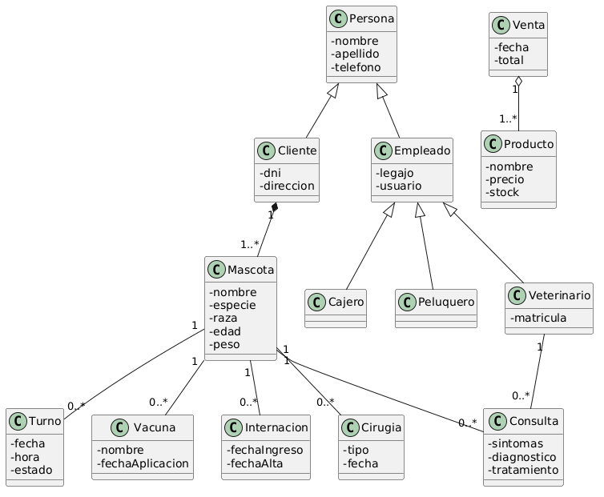
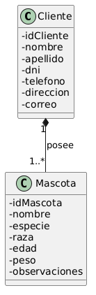
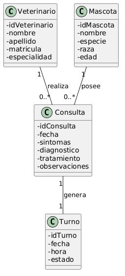
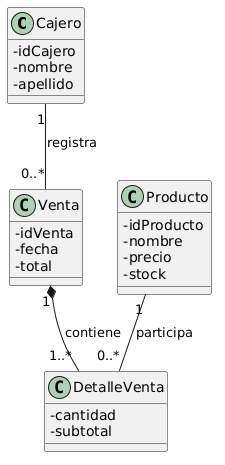

## 🧩 Modelo de Dominio

## 📖 Descripción

El modelo de dominio representa las principales entidades del sistema veterinario y sus relaciones.

---




# 📖 Explicación — Diagrama de Clases General

El diagrama de clases representa la estructura estática del sistema veterinario.

En él se identifican las principales entidades del dominio, sus atributos y las relaciones existentes entre ellas.

---

# 📌 Herencia

La clase `Persona` actúa como superclase generalizando atributos comunes como:
- nombre,
- apellido,
- teléfono.

De ella heredan:
- Cliente
- Empleado

A su vez, `Empleado` se especializa en:
- Veterinario
- Cajero
- Peluquero

La herencia permite reutilizar atributos y representar especializaciones del dominio.

---

# 📌 Composición

La relación entre `Cliente` y `Mascota` se modela mediante composición.

Esto indica que:
- las mascotas dependen conceptualmente de un cliente,
- y no pueden existir dentro del sistema sin estar asociadas a uno.

La multiplicidad:
```text
1 ---- 1..*
```

indica que:
- un cliente puede poseer múltiples mascotas,
- pero cada mascota pertenece a un único cliente.

---

# 📌 Asociación

Las asociaciones representan relaciones estructurales entre entidades del dominio.

Por ejemplo:
- una mascota puede tener múltiples consultas,
- vacunas,
- internaciones,
- cirugías,
- y turnos.

Además:
- un veterinario puede atender múltiples consultas.

---

# 📌 Agregación

La relación entre `Venta` y `Producto` se representa mediante agregación.

Esto indica que:
- una venta utiliza productos,
- pero los productos pueden existir independientemente de la venta.

La agregación representa una relación “todo-parte” débil.

---

# 📌 Multiplicidades

Las multiplicidades permiten indicar cuántas instancias de una clase pueden relacionarse con otra.

Ejemplos:
- una mascota puede tener muchas consultas,
- una venta puede incluir múltiples productos,
- un veterinario puede atender múltiples mascotas.

---




# 📖 Explicación — Relación Cliente y Mascota

Este diagrama representa la relación entre las entidades `Cliente` y `Mascota` dentro del sistema veterinario.

---

# 📌 Tipo de relación

La relación se modela mediante:
# ✅ composición

representada por el rombo negro.

La composición indica una relación fuerte de pertenencia y dependencia conceptual.

---

# 📌 Interpretación del dominio

En el sistema:
- una mascota debe pertenecer obligatoriamente a un cliente,
- y no puede existir registrada de manera independiente.

Por ello:
- si un cliente deja de existir en el sistema,
- conceptualmente sus mascotas también pierden sentido dentro del dominio modelado.

---

# 📌 Multiplicidad

La multiplicidad:

```text
1 -------- 1..*
```

indica que:

- un cliente puede poseer una o múltiples mascotas,
- pero cada mascota pertenece exclusivamente a un único cliente.

---

# 📌 Responsabilidades

La clase `Cliente` almacena:
- información personal,
- datos de contacto,
- y representa al propietario de las mascotas.

La clase `Mascota` representa al animal atendido dentro de la veterinaria.

Cada mascota mantiene información como:
- especie,
- raza,
- edad,
- peso,
- y observaciones médicas generales.

---

# 📌 Importancia del modelo

Este tipo de relación permite:
- representar correctamente dependencias del dominio,
- evitar entidades huérfanas,
- y mejorar la coherencia conceptual del sistema.

Además:
- sirve como base para posteriores relaciones con consultas, vacunas, internaciones y turnos.

---




# 📖 Explicación — Relación Consulta Veterinaria

Este diagrama representa las relaciones principales involucradas en el proceso de atención veterinaria dentro del sistema.

Participan las entidades:
- Veterinario,
- Mascota,
- Consulta,
- y Turno.

---

# 📌 Asociación Veterinario — Consulta

La relación entre `Veterinario` y `Consulta` se representa mediante una asociación.

La multiplicidad:

```text
1 -------- 0..*
```

indica que:
- un veterinario puede realizar múltiples consultas,
- pero cada consulta es realizada por un único veterinario.

Esta relación permite modelar la responsabilidad profesional sobre cada atención médica registrada.

---

# 📌 Asociación Mascota — Consulta

La entidad `Mascota` también se asocia con `Consulta`.

La multiplicidad:

```text
1 -------- 0..*
```

indica que:
- una mascota puede tener múltiples consultas a lo largo del tiempo,
- mientras que cada consulta corresponde únicamente a una mascota.

Esta relación permite construir el historial clínico veterinario.

---

# 📌 Asociación Consulta — Turno

La entidad `Consulta` se relaciona con `Turno`.

Esto representa que:
- una consulta médica se genera a partir de un turno previamente asignado.

La multiplicidad:

```text
1 -------- 1
```

indica que:
- cada consulta corresponde a un único turno,
- y cada turno genera una única consulta.

---

# 📌 Responsabilidades de las clases

## Veterinario

Representa al profesional encargado de la atención médica.

Contiene:
- matrícula profesional,
- especialidad,
- e información personal.

---

## Mascota

Representa al paciente veterinario.

Contiene:
- información general del animal,
- especie,
- raza,
- edad.

---

## Consulta

Representa el acto médico realizado durante la atención veterinaria.

Registra:
- síntomas,
- diagnóstico,
- tratamiento,
- observaciones clínicas.

---

## Turno

Representa la reserva de atención médica programada.

Incluye:
- fecha,
- horario,
- estado del turno.

---

# 📌 Importancia del modelo

Este diagrama permite representar:
- el flujo clínico de atención,
- la relación entre profesionales y pacientes,
- y la construcción del historial médico veterinario.

---



# 📖 Explicaión — Relación Ventas y Productos

Este diagrama representa las relaciones principales involucradas en el proceso de ventas dentro del sistema veterinario.

Participan las entidades:
- Cajero,
- Venta,
- Producto,
- y DetalleVenta.

---

# 📌 Asociación Cajero — Venta

La relación entre `Cajero` y `Venta` se representa mediante una asociación.

La multiplicidad:

```text
1 -------- 0..*
```

indica que:
- un cajero puede registrar múltiples ventas,
- mientras que cada venta es registrada por un único cajero.

---

# 📌 Composición Venta — DetalleVenta

La relación entre `Venta` y `DetalleVenta` se modela mediante:

# ✅ composición

representada por el rombo negro.

La composición indica una relación fuerte de pertenencia y dependencia existencial.

Esto significa que:
- una venta está compuesta por múltiples detalles de venta,
- y cada `DetalleVenta` depende completamente de una `Venta` para existir dentro del sistema.

Por ello:
- si una venta es eliminada,
- sus detalles asociados también dejan de existir.

La multiplicidad:

```text
1 -------- 1..*
```

indica que:
- una venta debe contener al menos un detalle de venta,
- mientras que cada detalle pertenece exclusivamente a una única venta.

---

# 📌 Asociación Producto — DetalleVenta

La entidad `Producto` se relaciona con `DetalleVenta`.

Esto permite:
- registrar qué productos fueron vendidos,
- cantidad,
- y subtotal correspondiente.

La multiplicidad:

```text
1 -------- 0..*
```

indica que:
- un producto puede aparecer en múltiples detalles de venta.

---

# 📌 Responsabilidades de las clases

## Cajero

Representa al empleado encargado de realizar operaciones de cobro y ventas.

---

## Venta

Representa la transacción comercial realizada dentro de la veterinaria.

Incluye:
- fecha,
- importe total.

---

## Producto

Representa artículos comercializados por la veterinaria.

Contiene:
- nombre,
- precio,
- stock disponible.

---

## DetalleVenta

Representa cada línea individual de productos incluidos dentro de una venta.

Registra:
- cantidad,
- subtotal.

---

# 📌 Importancia del modelo

Este tipo de modelado permite:
- representar ventas compuestas por múltiples productos,
- mantener trazabilidad comercial,
- y controlar stock de productos vendidos.

---

# 📌 Objetivo del modelo

El diagrama de clases permite:
- comprender la estructura del dominio,
- identificar responsabilidades,
- modelar relaciones,
- y servir de base para el diseño orientado a objetos y diagramas dinámicos posteriores.
