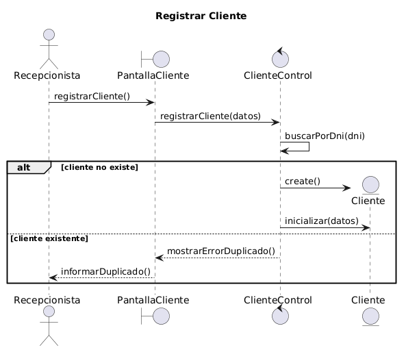

# 👤 Registrar Cliente

---

## 📖 Explicacion de la secuencia

El proceso comienza cuando la recepcionista solicita registrar un nuevo cliente en el sistema veterinario.

Desde la interfaz `PantallaCliente`, la recepcionista ingresa los datos personales del cliente:
- nombre,
- apellido,
- DNI,
- teléfono,
- dirección,
- y correo electrónico.

La pantalla envía la solicitud al objeto de control `ClienteControl`, responsable de coordinar el flujo del caso de uso.

Inicialmente, el controlador realiza una autodelegación para buscar si ya existe un cliente registrado con el mismo DNI.

A continuación, el flujo se divide mediante un frame `alt`, representando dos escenarios posibles:

---

## ✅ Escenario 1 — Cliente no existente

Si el cliente no existe previamente en el sistema:
- el controlador crea dinámicamente una nueva entidad `Cliente`,
- e inicializa sus atributos utilizando los datos ingresados por la recepcionista.

Posteriormente, se produce una nueva bifurcación mediante un segundo frame `alt`.

---

## ❌ Escenario 2 — Cliente existente

Si durante la búsqueda inicial se detecta que ya existe un cliente registrado con el mismo DNI:
- el controlador evita la creación de una nueva entidad,
- y comunica a la interfaz que el cliente ya existe.

Finalmente:
- la pantalla informa el error correspondiente a la recepcionista,
- evitando registros duplicados dentro del sistema.

---

# 📌 Aspectos importantes del diagrama

- El diagrama sigue el patrón MVC:
  - `Boundary` → interacción con el usuario.
  - `Control` → coordinación del caso de uso.
  - `Entity` → lógica y datos del dominio.

- `ClienteControl` coordina el flujo principal del proceso.

- La entidad `Cliente` encapsula su propia lógica de validación mediante autodelegación.

- El frame `alt` modela comportamientos alternativos:
  - cliente existente,
  - cliente inexistente,
  - datos válidos,
  - datos inválidos.

- La instrucción `create` representa la creación dinámica de un objeto del dominio.

- El diagrama mantiene un nivel de análisis UML, evitando detalles de persistencia o acceso a base de datos.

