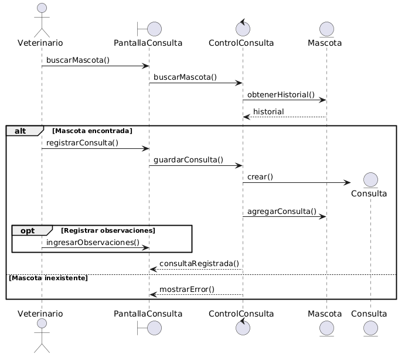

---

## 📖 Explicación

El proceso comienza cuando el veterinario
busca una mascota para atenderla.

La pantalla solicita los datos al controlador,
quien consulta el historial clínico de la mascota.

Si la mascota existe:
- se registra la consulta,
- se almacena el diagnóstico,
- y se asocia al historial clínico.

Finalmente:
- el sistema confirma la operación.

---

## 📌 Frames utilizados

| Frame | Uso |
|---|---|
| alt | validación |
| opt | observaciones opcionales |