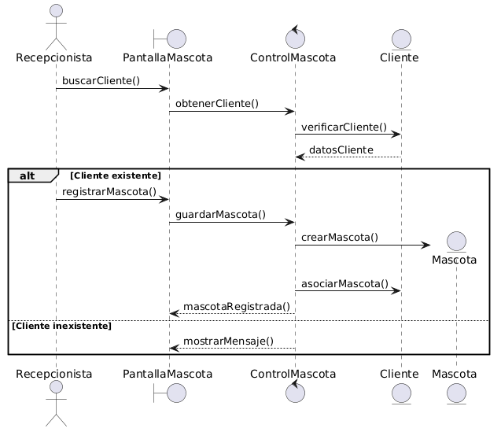

# 🐶 Registrar Mascota

---

# 📖 Explicación de la secuencia

El proceso comienza cuando la recepcionista necesita registrar una mascota para un cliente existente.

Primero:
- se busca el cliente en el sistema,
- utilizando DNI u otro dato identificatorio.

La pantalla envía la solicitud al controlador, quien valida si el cliente existe.

Si el cliente es válido:
- la recepcionista registra los datos de la mascota:
  - nombre,
  - especie,
  - raza,
  - edad,
  - peso,
  - observaciones.

Luego:
- el controlador crea la entidad `Mascota`,
- y la asocia al cliente correspondiente.

Opcionalmente:
- pueden registrarse observaciones adicionales.

Finalmente:
- el sistema confirma el registro exitoso de la mascota.

Si el cliente no existe:
- el sistema informa el error correspondiente.

---

## 📌 Frames utilizados

| Frame | Uso |
|---|---|
| alt | Validación de existencia del cliente |
| opt | Registro opcional de observaciones |

---

## 📌 Aspectos importantes

- Toda mascota debe pertenecer a un cliente.
- La creación de la mascota es responsabilidad del controlador.
- La asociación Cliente-Mascota surge del modelo de dominio.

