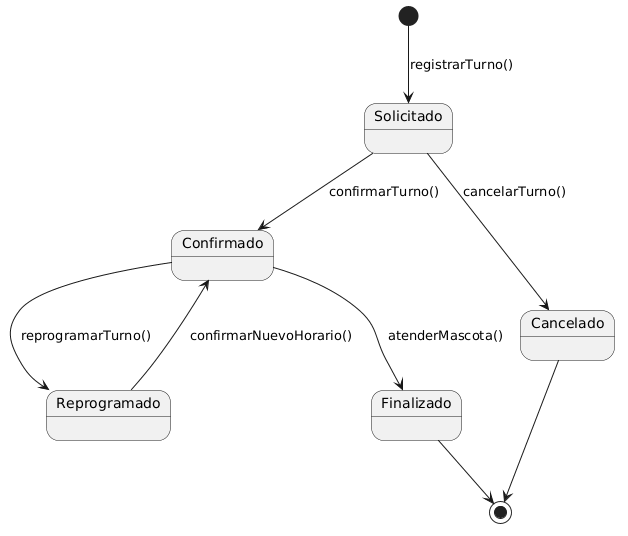

# Diagrama de Estados — Turno Veterinario

El diagrama de estados representa el ciclo de vida de un turno dentro del sistema veterinario.

Este tipo de diagrama permite modelar:
- estados posibles de un objeto,
- eventos que provocan cambios,
- y transiciones entre estados.

---

# 📌 Diagrama

---

# 📖 Explicación

El objeto `Turno` atraviesa distintos estados durante su existencia dentro del sistema.

Inicialmente:
- el turno se encuentra en estado `Solicitado`.

Cuando la recepción confirma la reserva:
- el turno cambia al estado `Confirmado`.

Si el cliente decide cancelar:
- el turno pasa al estado `Cancelado`.

Si el horario debe modificarse:
- el turno cambia al estado `Reprogramado`.

Luego de confirmar el nuevo horario:
- el turno vuelve al estado `Confirmado`.

Finalmente:
- cuando la mascota es atendida,
- el turno pasa al estado `Finalizado`.

Los estados `Cancelado` y `Finalizado` representan estados terminales del ciclo de vida.

---

# 📌 Objetivo del modelo

El diagrama de estados permite:
- representar el comportamiento dinámico de un objeto,
- comprender transiciones del dominio,
- y modelar cambios de estado provocados por eventos del sistema.

Además:
- complementa los diagramas de secuencia y clases dentro del análisis orientado a objetos.

